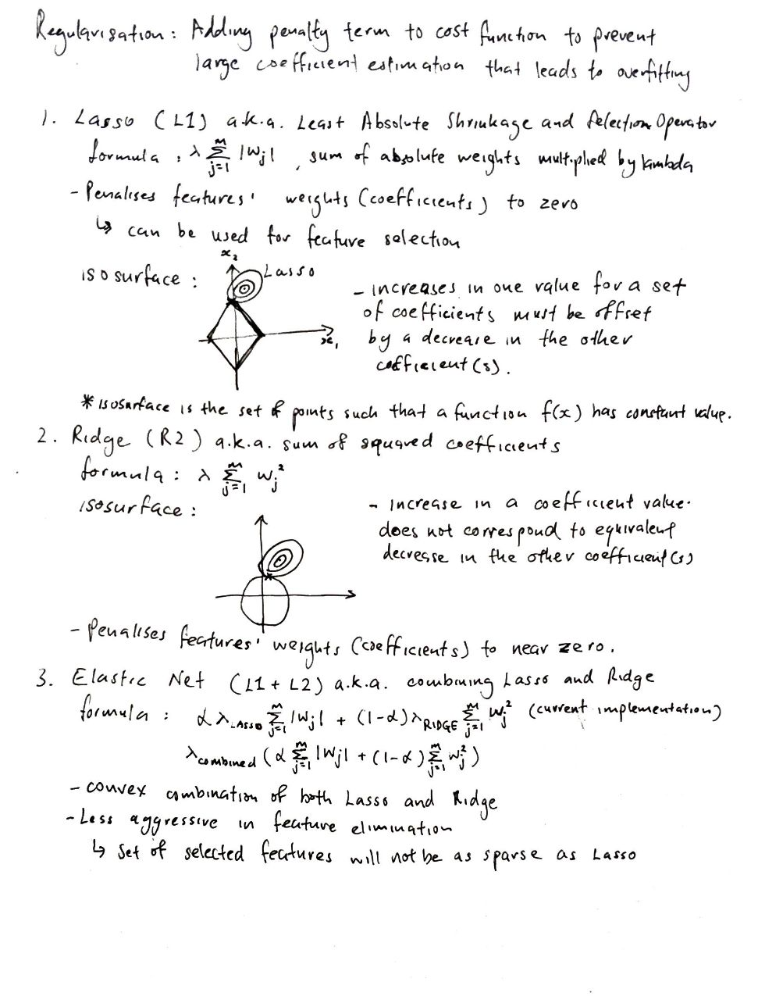

# panpy-ml
Machine learning algorithms implemented from scratch using pandas and numpy. 

[Mathematical intuition for regression algorithms](regression/README.md)

[Mathematical intuition for classification algorithms](classification/README.md)

Mathematical intuition for regularisations:
