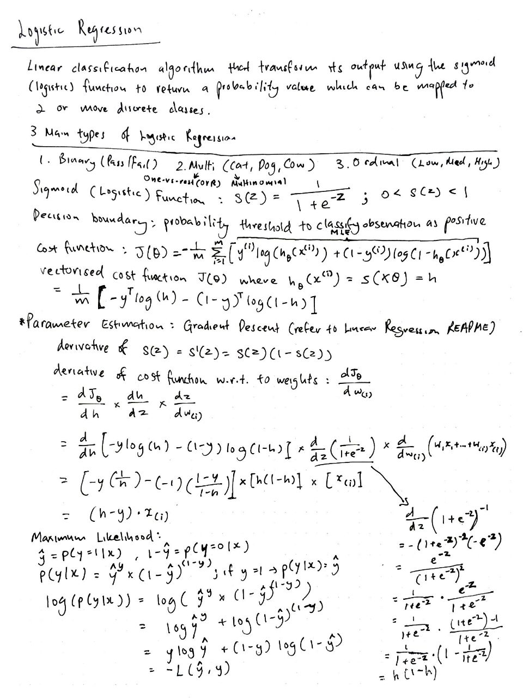
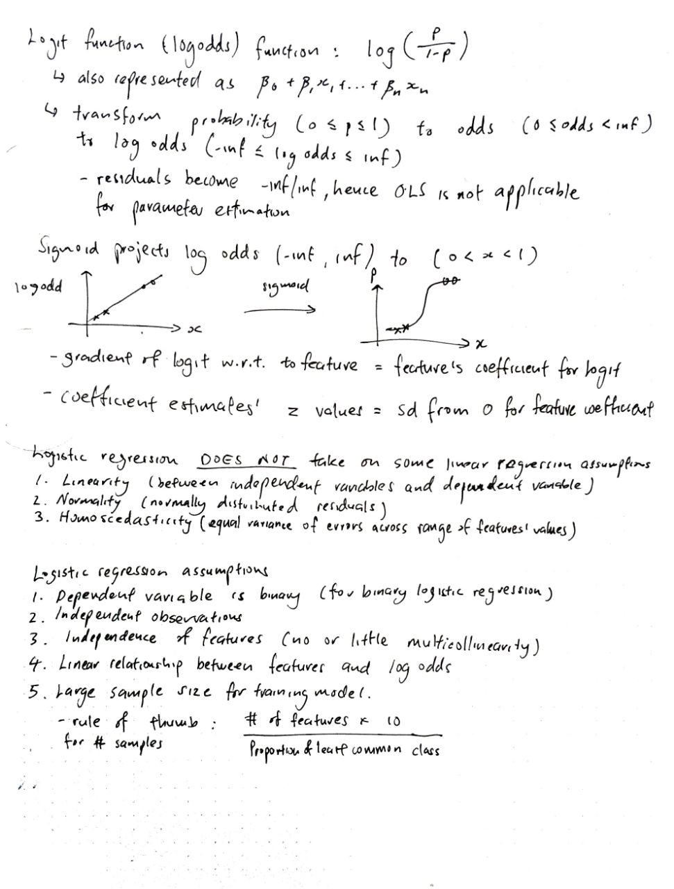
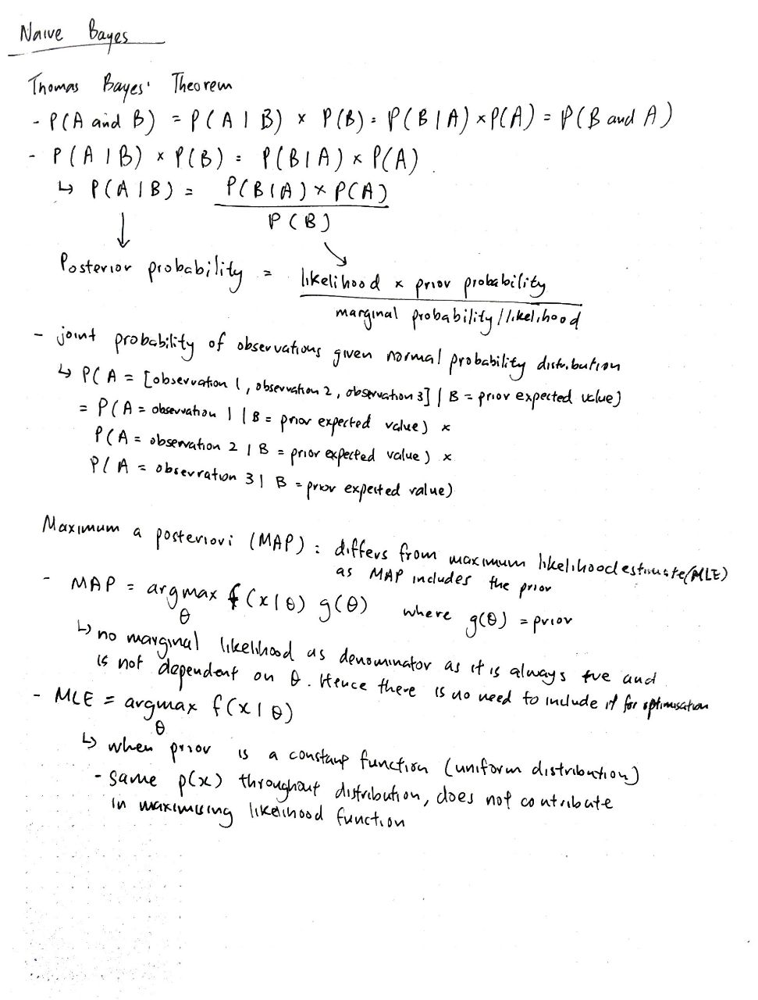
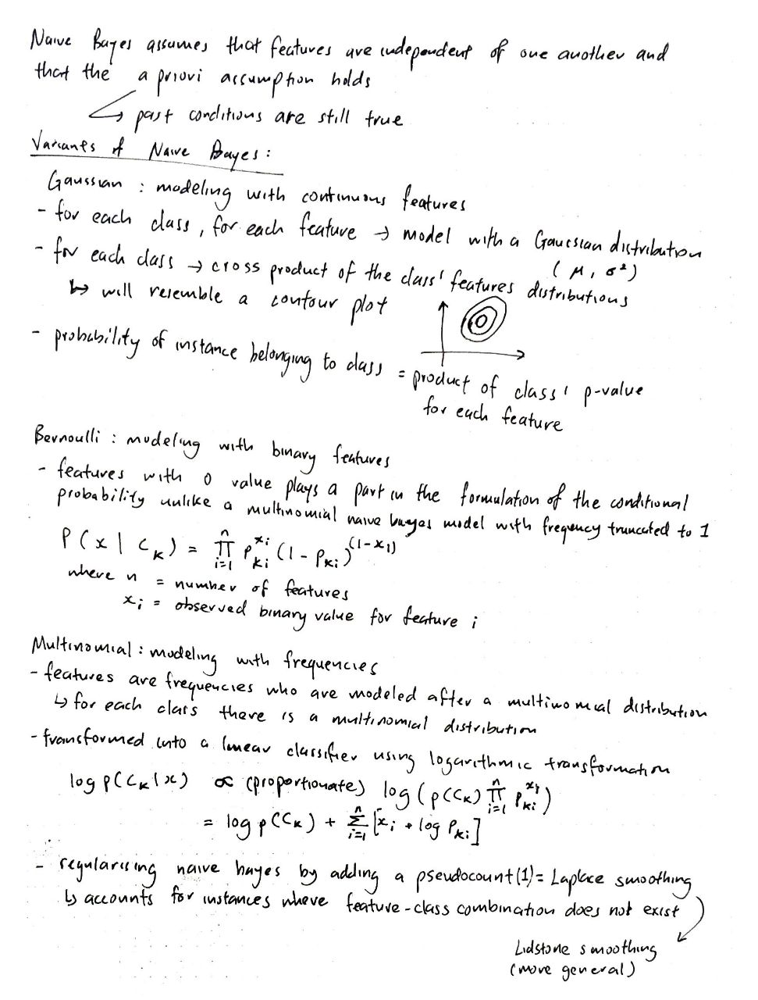

# Classification models, implementation using NumPy and Pandas

## Table of Contents:
1. [Logistic Regression](#mathematical-intuition-for-logistic-regression)
2. [Naive Bayes](#mathematical-intuition-for-naive-bayes)

## Mathematical intuition for Logistic Regression:

## Mathematical intuition for Naive Bayes:

