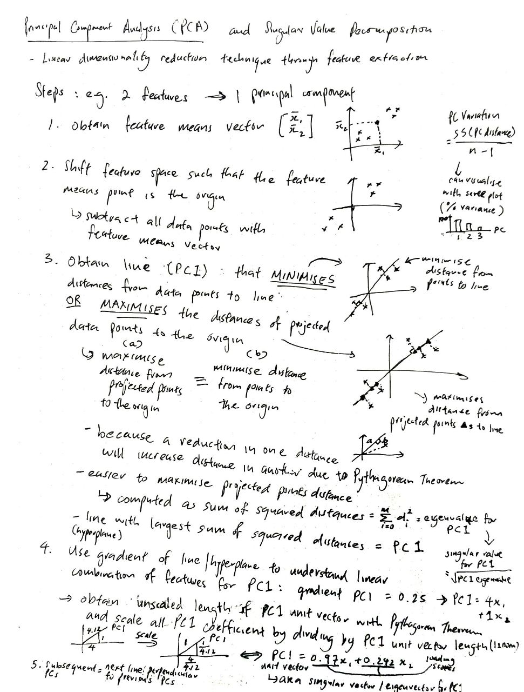

# Dimensionality reduction algorithms, implementation using NumPy and Pandas

| Algorithm                 | Mathematical Intuition     | Code Implementation |
| ------------------------- | -------------------------- | ------------------- |
| Principal Component Analysis | [Link](#mathematical-intuition-for-principal-component-analysis) | 

---

## Mathematical intuition for Principal Component Analysis
