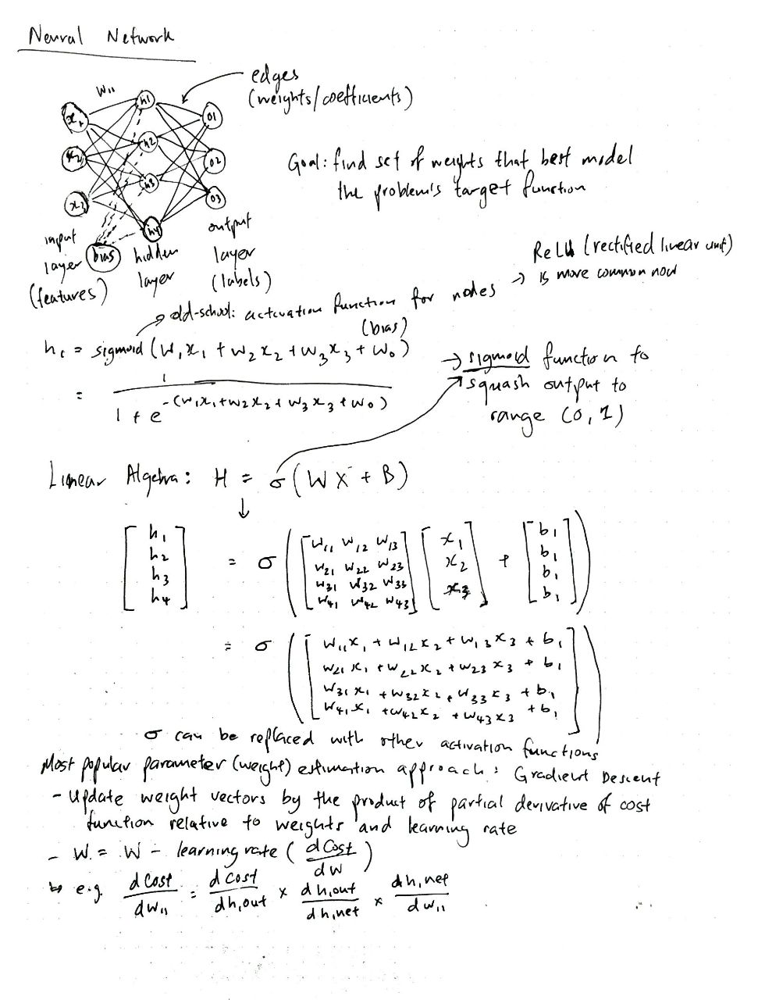

# Neural network models, implementation using NumPy and Pandas

| Algorithm                 | Mathematical Intuition     | Code Implementation |
| ------------------------- | -------------------------- | ------------------- |
| Basic Neural Network | [Neural Network Fundamentals](#mathematical-intuition-for-neural-network) | 

---

## Mathematical intuition for basic Neural Network:
