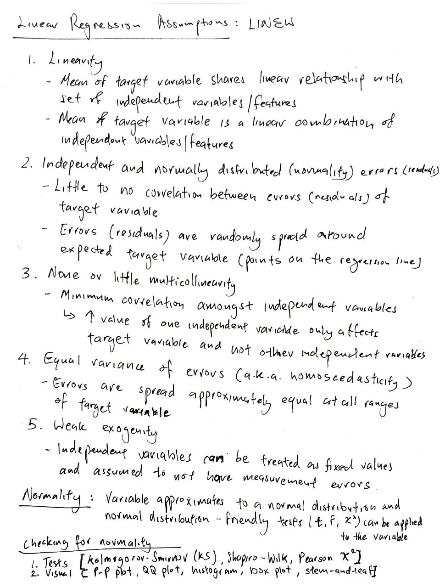
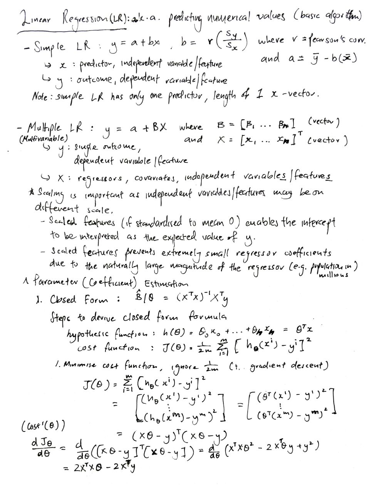

# Regression models, implementation using NumPy and Pandas

## Table of Contents:
1. [Linear Regression](#mathematical-intuition-for-linear-regression)

## Mathematical intuition for Linear Regression:

