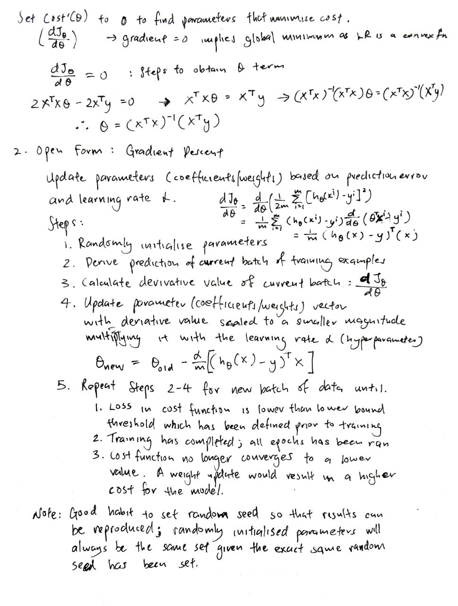

# Regression models, implementation using NumPy and Pandas

| Algorithm                 | Mathematical Intuition     | Code Implementation |
| ------------------------- | -------------------------- | ------------------- |
| Linear Regression (Simple, Multiple) | [Link](#mathematical-intuition-for-linear-regression) | [linear.py](linear.py)
| Gradient Descent                     | [Link](#mathematical-intuition-for-linear-regression) | [optimisation.py](optimisation.py)

---

## Mathematical intuition for Linear Regression:

