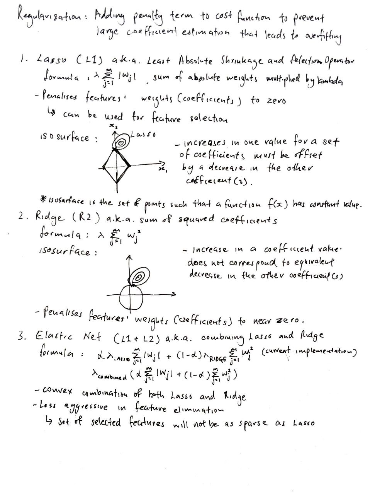

# Regularisation algorithms, implementation using NumPy and Pandas

## Table of Contents:
1. [Regularisations](#mathematical-intuition-for-regularisations)

## Mathematical intuition for regularisations:

