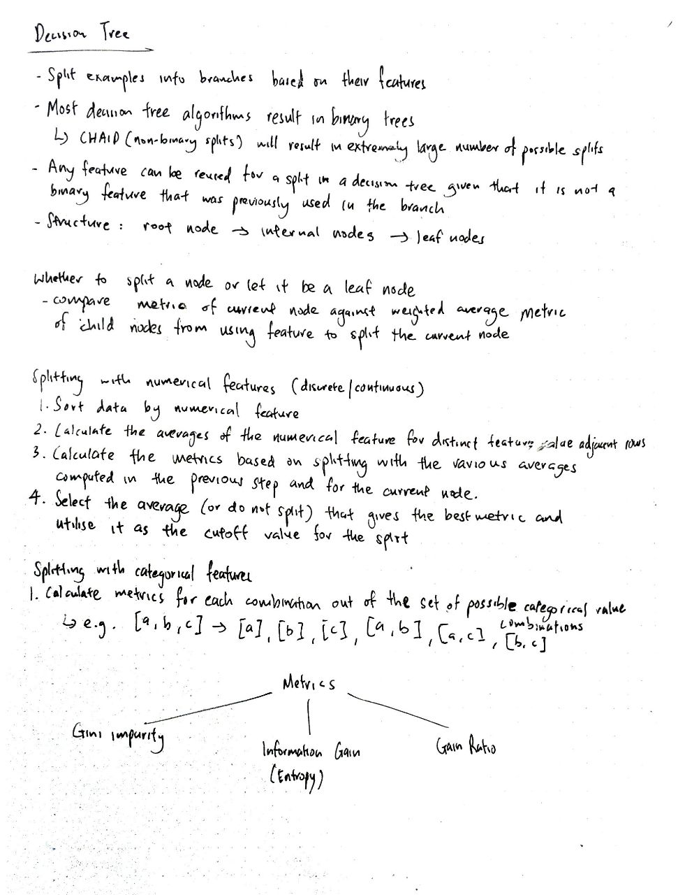
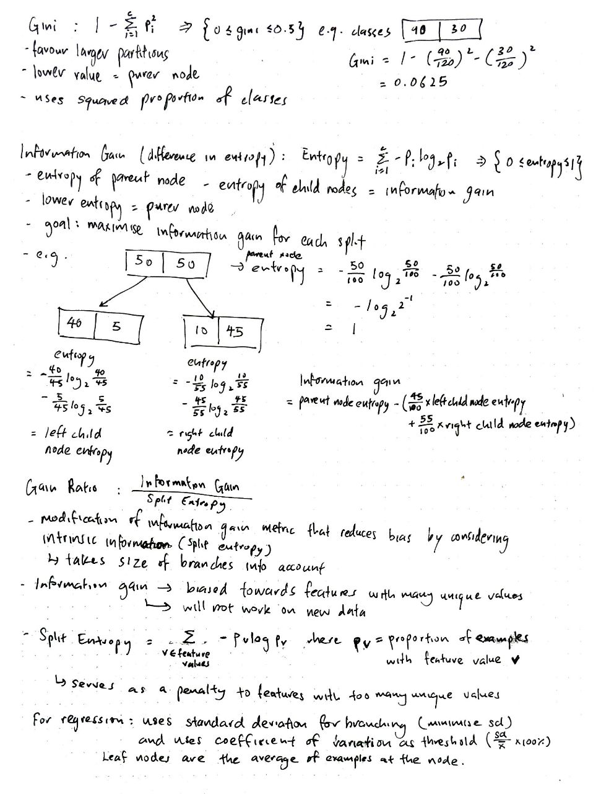
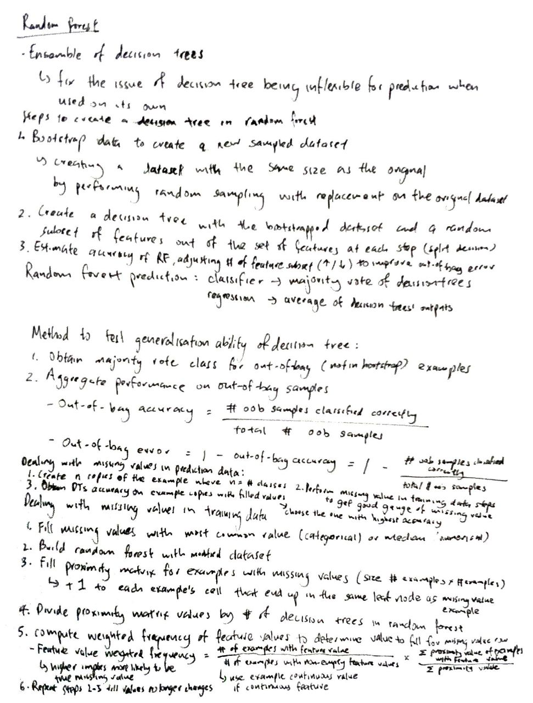
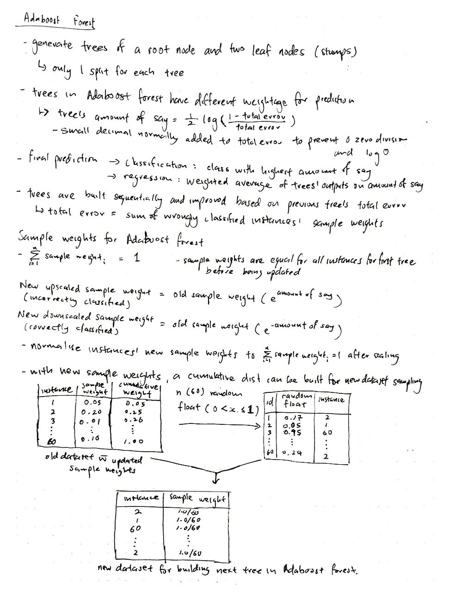

# Tree-based models, implementation using NumPy and Pandas

## Table of Contents:
1. [Decision Trees](#mathematical-intuition-for-decision-trees)
2. [Random Forest](#mathematical-intuition-for-random-forest)
3. [Adaboost Forest](#mathematical-intuition-for-adaboost-forest)

## Mathematical intuition for Decision Trees:

## Mathematical intuition for Random Forest:

## Mathematical intuition for Adaboost Forest:

