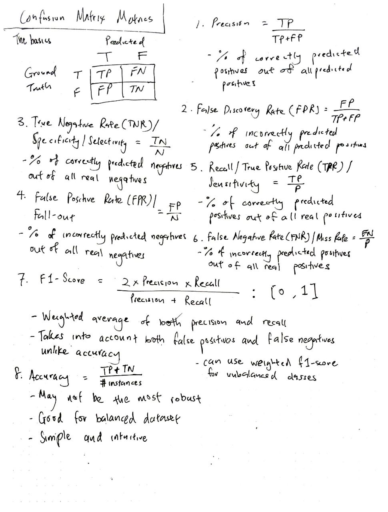
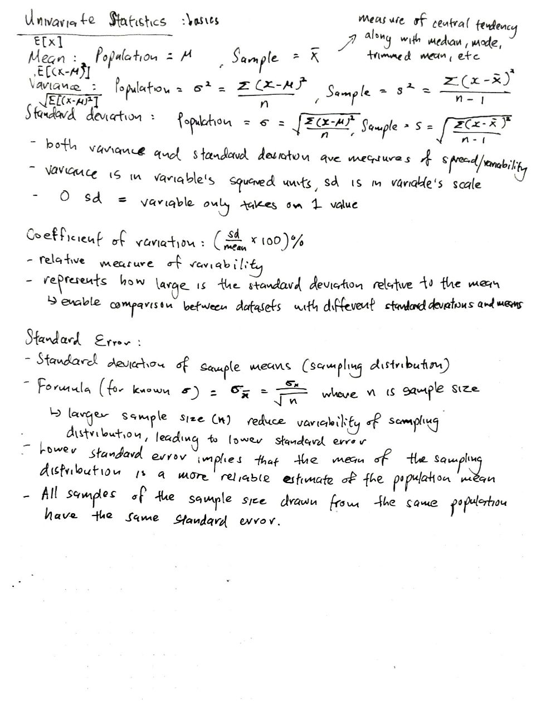
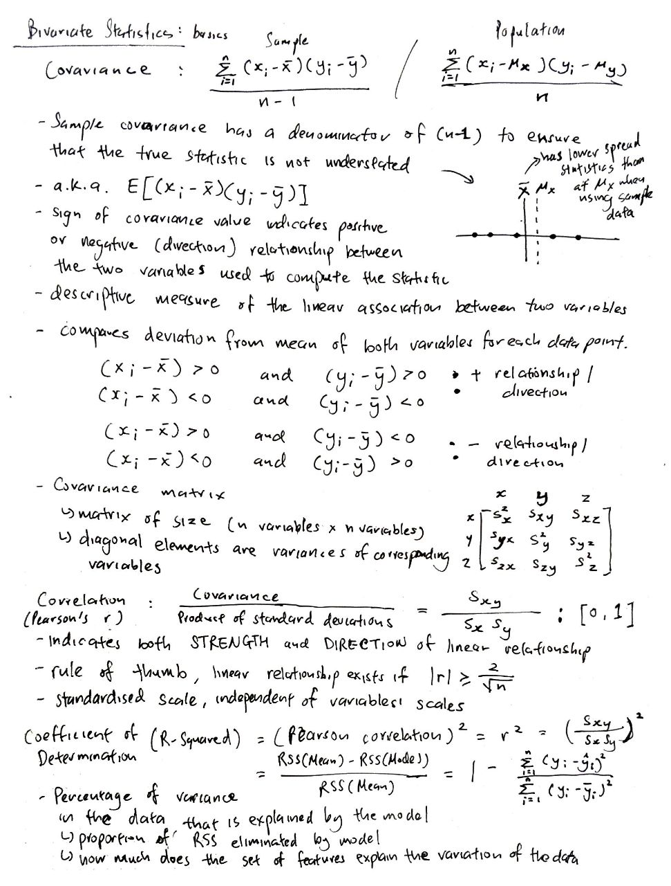
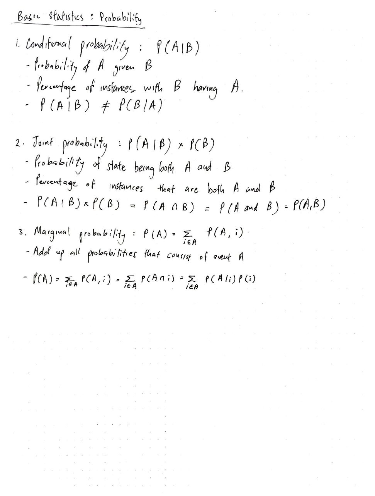

# Formulae, etc. implementation using NumPy and Pandas

| Algorithm                 | Mathematical Intuition     | Code Implementation |
| ------------------------- | -------------------------- | ------------------- |
| Confusion matrix metrics  | [Link](#mathematical-intuition-for-confusion-matrix-metrics)
| Basic univariate stats    | [Link](#mathematical-intuition-for-basic-univariate-statistics)
| Basic bivariate stats     | [Link](#mathematical-intuition-for-basic-bivariate-statistics)
| Basic probaility stats    | [Link](#mathematical-intuition-for-basic-probability-statistics)

---

## Mathematical intuition for confusion matrix metrics:

## Mathematical intuition for basic univariate statistics:

## Mathematical intuition for basic bivariate statistics:

## Mathematical intuition for basic probability statistics:
