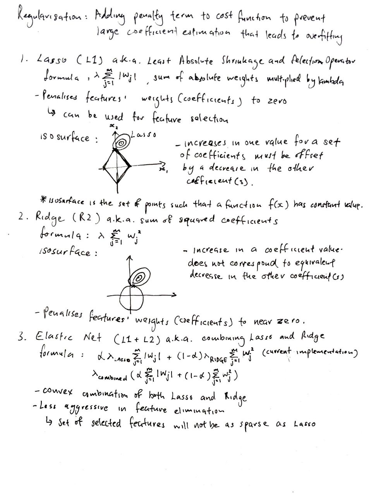

# Formulae, etc. implementation using NumPy and Pandas

## Table of Contents:
1. [Regularisations](#mathematical-intuition-for-regularisations)
2. [Confusion matrix metrics](#mathematical-intuition-for-confusion-matrix-metrics)
3. [Basic univariate statistics](#mathematical-intuition-for-basic-univariate-statistics)
4. [Basic bivariate statistics](#mathematical-intuition-for-basic-bivariate-statistics)

## Mathematical intuition for regularisations:

## Mathematical intuition for confusion matrix metrics:

## Mathematical intuition for basic univariate statistics:

## Mathematical intuition for basic bivariate statistics:
